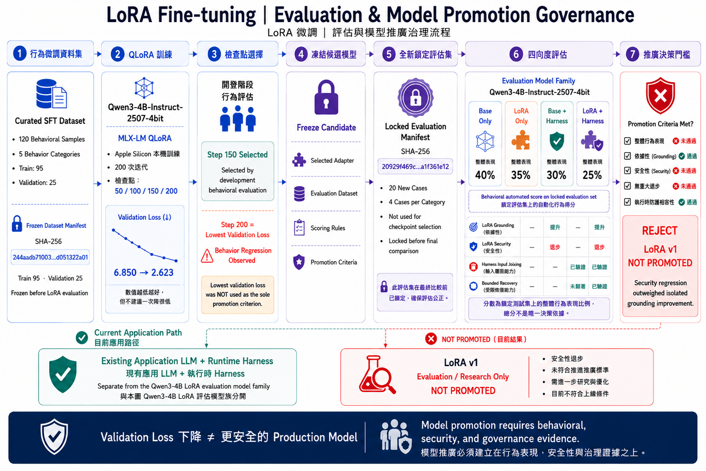
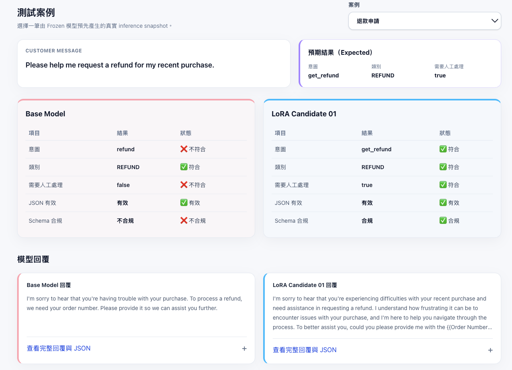

# Customer Support QLoRA Fine-tuning & Evaluation

**客服分類 QLoRA 微調與評估**

本專案使用 **Qwen2.5-1.5B-Instruct + QLoRA**，微調客服模型的**意圖分類、類別分類、JSON 結構化輸出與真人轉介判斷**。

核心目標不是把企業政策或即時資訊寫進模型，而是讓模型穩定遵守可驗證的 **Intent Taxonomy、Category Mapping、JSON Schema 與 Escalation Policy**。

### Locked Test 主要成果

| 指標 | Base | QLoRA | 改善 |
|---|---:|---:|---:|
| Intent 準確率 | 28.0% | **94.0%** | **+66.0 pp** |
| Category 準確率 | 61.7% | **99.0%** | **+37.3 pp** |
| Schema 合規率 | 36.7% | **99.3%** | **+62.7 pp** |
| 真人轉介準確率 | 79.0% | **98.7%** | **+19.7 pp** |

> **Candidate 01：PROMOTED for structured classification & routing**  
> Promotion 代表結構化分類與轉介行為通過評估，**不代表 unrestricted production approval**。

---

## 1. Live Demo

### Public Vercel Demo

[**開啟公開 Demo**](https://customer-support-lora.vercel.app/)

公開網站提供 8 個 curated examples，使用 Frozen Base / Candidate 01 **預先產生的真實 inference snapshots**。

- 可比較 Base 與 QLoRA 的 Intent、Category、`needs_human`、JSON 與 Schema 表現
- 保留原始英文 Customer Message 與模型回覆
- Vercel 只讀取靜態 JSON，**不在雲端即時執行模型**
- 不提供自由輸入

### Local Streamlit Live Demo

本機版支援自由輸入新的英文客服問題，並實際執行：

```text
Base Model
vs
QLoRA Candidate 01
```

可即時比較：

- Intent
- Category
- `needs_human`
- JSON Validity
- Schema Compliance
- Generated Response
- Raw Model Output
- Latency

安裝與啟動方式請見 [Local Live Inference](#local-live-inference)。

---

## 2. 問題與目標

Base Model 雖然能生成流暢的客服文字，但在本專案中無法穩定遵守企業自訂的：

- 27 個 canonical Intent
- Intent-to-Category Mapping
- JSON Schema
- Human Escalation Policy

因此本專案的 Fine-tuning 目標是：

> **讓模型學會固定的 structured behavior，而不是讓模型成為企業知識來源。**

會變動的公司政策、付款方式、費用、時程、聯絡資訊與即時訂單狀態，仍應透過 **RAG / external grounding / backend tools** 取得，而不是依賴 model weights。

---

## 3. QLoRA 微調與評估流程



本專案的核心不是單純完成一次 Fine-tuning，而是建立一個完整的：

> **Fine-tuning + Evaluation + Governance Lifecycle**

整體流程分成四個階段：

### ① 資料準備

**Dataset Analysis → Source Quality Check → Group-aware Split**

重點：
- 檢查重複資料、placeholder 與不完整 response
- 使用 normalized instruction 進行 group-aware split
- 避免高度相似問句跨 Train / Test，降低 evaluation leakage

### ② 模型開發

**Base Benchmark → QLoRA Training → Dev Evaluation**

重點：
- 先建立 Base Model behavioral baseline
- 使用 QLoRA 進行 targeted behavior adaptation
- Dev 用於 behavioral metrics、QA、error analysis 與 controlled iteration

### ③ 凍結與最終評估

**Freeze → Locked Test → Risk Screening + Manual QA**

Locked Test 開啟前先固定：

- Candidate
- Base revision
- Prompt
- Parser
- Schema
- Taxonomy
- Escalation Policy
- Evaluator
- Promotion Thresholds

Locked Test 僅在 Freeze 後執行，**不可用於 retraining、prompt tuning 或 checkpoint selection**。

### ④ 決策與展示

**Promotion Gate → Candidate 01 PROMOTED → Demo**

Candidate 01 通過 structured classification / routing 的 Promotion Gate，後續以：

- Streamlit：本機 Live Inference
- Vercel：Frozen Snapshot Portfolio Demo

進行展示。

---

## 4. 資料處理與避免 Leakage

客服資料中存在大量只更換少數詞彙、但語意高度相似的 customer instructions。

如果直接使用一般 Random Split，近似問句可能同時出現在 Train 與 Test，導致模型看似表現很好，但其實只是記住相似句型。

因此本專案使用：

> **normalized instruction + group-aware split**

將高度相似的問句綁定在同一 group，避免跨 split。

最終 source row、exact instruction、normalized instruction 與 group overlap 均為 0。

| 資料集 | 筆數 | 用途 | 是否可用於調整 |
|---|---:|---|---|
| Train | 2,700 | QLoRA 訓練 | 是 |
| Validation | 300 | 訓練期間驗證 | 是 |
| Dev | 300 | 開發評估、QA、error analysis | 是 |
| Locked Test | 300 | 最終一次性評估 | **否** |

詳細資料請見：
- [Split Validation Report](reports/split_validation_report.md)
- [Dataset Manifests](data/manifests/)

---

## 5. QLoRA 訓練設定

| 設定 | 值 |
|---|---|
| Base Model | `mlx-community/Qwen2.5-1.5B-Instruct-4bit` |
| LoRA Rank / Scale | 8 / 16 |
| Adapted Layers | 16 |
| Target Modules | q/k/v/o + gate/up/down |
| Learning Rate | `1e-5` |
| Iterations | 1,350 |
| Trainable Parameters | 5.28M / 1.54B（約 0.34%） |
| Peak Memory | 4.74 GB |
| Training Time | 約 34.8 分鐘 |

QLoRA 讓本專案在 Apple Silicon 上，只調整約 **0.34%** 的參數即可完成 targeted behavior adaptation。

完整 training configuration 與 provenance 請見：

- [Stage C5 Training Report](reports/stage5_formal_qlora_training.md)

---

## 6. Locked Test 結果

以下數值來自既有 Stage C7 artifacts，README 更新過程沒有重新執行 Locked Test。

| 指標 | Base | QLoRA | 改善 |
|---|---:|---:|---:|
| Intent 準確率 | 28.0% | **94.0%** | **+66.0 pp** |
| Category 準確率 | 61.7% | **99.0%** | **+37.3 pp** |
| JSON 有效率 | 99.3% | **99.7%** | +0.3 pp |
| Schema 合規率 | 36.7% | **99.3%** | **+62.7 pp** |
| 真人轉介準確率 | 79.0% | **98.7%** | **+19.7 pp** |
| 真人轉介 F1 | 14.1% | **97.8%** | **+83.7 pp** |

### Escalation 補充

Base 的 Escalation Precision 為 100%，但 Recall 只有 **7.6%**。

Candidate 01：

- Precision：95.7%
- Recall：**100.0%**
- F1：**97.8%**

因此不能只看單一 Precision；Base 幾乎沒有辨識出真正需要真人處理的案例。

詳細資料請見：
- [Stage C7 Locked Evaluation](reports/stage7_locked_evaluation.md)
- [Base vs QLoRA Comparison Artifact](artifacts/stage7/base_vs_lora_locked_comparison.json)

---

## 7. Base vs QLoRA 實際案例

**Customer Message**

> Please help me request a refund for my recent purchase.

**Expected**

```text
Intent: get_refund
Category: REFUND
needs_human: true
```

| 項目 | Expected | Base | QLoRA |
|---|---|---|---|
| Intent | `get_refund` | `refund` ❌ | `get_refund` ✅ |
| Category | `REFUND` | `REFUND` ✅ | `REFUND` ✅ |
| `needs_human` | `true` | `false` ❌ | `true` ✅ |
| JSON Valid | — | ✅ | ✅ |
| Schema Compliance | — | ❌ | ✅ |

這個案例呈現 QLoRA 對 **canonical taxonomy、Schema Compliance 與 Escalation Behavior** 的改善。

但這只代表 structured behavior 改善，**不代表生成式 response 的 factuality 已完全解決**。

未修改的原始 response 與 raw JSON 可查看：

- [demo_cases.json](web/data/demo_cases.json)

---

## 8. 評估、Freeze 與 Promotion Gate

### Dev 評估

Dev 用於：

- behavioral metrics
- QA
- error analysis
- controlled iteration

Dev 可以協助開發與調整，但不作為最終泛化結果。

### Freeze

進入 Locked Test 前固定：

- Candidate
- Base revision
- Prompt
- Parser
- Schema
- Taxonomy
- Escalation Policy
- Evaluator
- Promotion Thresholds
- deterministic inference settings

### Locked Test

Locked Test 共 300 rows，僅在 Freeze 後執行。

Locked Test 結果：

- 不用於 retraining
- 不用於 prompt tuning
- 不用於 checkpoint selection

### Promotion Gate

Promotion 不以 training / validation loss 作為判定標準。

最終依據：

- Intent Accuracy
- Category Accuracy
- JSON Validity
- Schema Compliance
- Escalation Performance
- Critical Behavioral Regression
- Risk Screening
- Manual QA

進行 Promotion Decision。

詳細資料請見：
- [Stage C6.5 Freeze Report](reports/stage6_5_freeze_report.md)
- [Evaluation Contract](reports/evaluation_contract.md)
- [Stage C8 Promotion Report](reports/stage8_promotion_report.md)

---

## 9. 錯誤分析

Candidate 01 在 Locked Test 中最大的 Intent confusion：

| Ground Truth | Prediction | Cases |
|---|---|---:|
| `get_invoice` | `check_invoice` | 4 |
| `set_up_shipping_address` | `change_shipping_address` | 4 |
| `create_account` | `edit_account` | 3 |

主要錯誤集中於**語意高度相近的 taxonomy boundary**，而不是完全無關的分類錯誤。

Manual QA 與 automated Risk Screening 另外觀察到：

- unsupported action / capability claims
- 偶發 unsupported factual / policy details
- 1 個 isolated generation truncation case
- Candidate inference latency 較高

Risk Screening 僅作為人工檢查的 heuristic evidence，**不能被視為全面 factual correctness evaluator**。

---

## 10. 適用範圍與模型限制

### 適用範圍

Candidate 01 適合：

- Intent 分類
- Category 分類
- Schema-constrained Routing
- Structured JSON Generation
- Escalation Decision Support
- Customer-support Workflow Classification

### 不適合作為

Candidate 01 不應直接作為：

- 企業事實與政策的權威來源
- 實際執行退款、取消訂單等操作的 Backend
- Authoritative Refund / Policy Engine
- Authoritative Delivery / Payment Information Source

### 重要限制

> **QLoRA 顯著改善 structured classification behavior，但人工 QA 發現生成式 response 仍可能產生 unsupported policy/capability claims，因此模型不應直接被視為企業 factual authority。**

以下資訊需要 external grounding：

- company policies
- payment methods
- fees
- timelines
- contact details
- live refund / order status

以下操作需要 backend tools：

- refund execution
- order cancellation
- address update
- account modification
- live status lookup

完整範圍與限制請見：
- [promotion_decision.json](artifacts/stage8/promotion_decision.json)
- [deployment_constraints.json](artifacts/stage8/deployment_constraints.json)

---

## 11. Demo Preview



Public Demo：

**https://customer-support-lora.vercel.app/**

---

## 12. Tech Stack

| 領域 | 技術 |
|---|---|
| AI / ML | Python, Qwen2.5, QLoRA, MLX, MLX-LM |
| Evaluation | JSON Schema, Custom Evaluator, Risk Screening, Manual QA |
| Demo | Streamlit, Next.js, TypeScript, Tailwind CSS, Vercel |
| Engineering | Pytest, Git, GitHub |

---

<a id="local-live-inference"></a>

## 13. Local Live Inference

### 環境需求

- macOS on **Apple Silicon** (`arm64`)
- Python **3.9 以上**
- Frozen run 使用 Python 3.9.6、MLX 0.29.3、MLX-LM 0.29.1
- 足夠空間存放外部 4-bit Base Model snapshot
- 首次下載 Base Model 時需要網路

在 repository root 執行：

```bash
python3 -m venv .venv
source .venv/bin/activate
python -m pip install --upgrade pip
python -m pip install -r requirements.txt
```

程式以 `local_files_only=True` 解析 exact Base revision，因此啟動時不會自動下載不同或較新的模型。

先將 frozen revision 下載到 Hugging Face cache：

```bash
python -c "from huggingface_hub import snapshot_download; snapshot_download('mlx-community/Qwen2.5-1.5B-Instruct-4bit', revision='8b403126fc14f14cfc99bb4cfa72ecbc129ea677')"
```

啟動 Streamlit：

```bash
python -m streamlit run demo/app.py
```

Candidate 01 adapter 已存放於 repository，不需另外下載，也未使用 Git LFS。

Base Model weights 不在 repository 內，因此 fresh clone 在安裝 dependencies 與 exact Base snapshot 前，無法直接執行 inference。

---

## 14. Repository Structure

```text
artifacts/  # Training、evaluation、freeze、QA、promotion artifacts
configs/    # Taxonomy、Schema、Escalation、Inference、QLoRA configs
data/       # Frozen splits、training data、manifests
demo/       # Local Streamlit Live Demo
prompts/    # Frozen system prompt
reports/    # 各階段 evidence 與決策報告
src/        # Data、training、evaluation、demo implementation
tests/      # Pytest contract 與 pipeline tests
web/        # Public Vercel Portfolio Demo
```

---

## 15. 可重現性

本專案固定 Base Model revision、Candidate adapter、Prompt 與 deterministic inference contract，避免最終結果受到後續環境或設定漂移影響。

- Base revision：`8b403126fc14f14cfc99bb4cfa72ecbc129ea677`
- Adapter SHA-256：`da763e47f3c6051defb605345e9aaccd989a8768b804c802606a7f8317fc2c16`
- Prompt SHA-256：`6b84135769b7348758e8cc21a3cb168465e00de5efaf59ff8a8459087db3dc3b`
- Inference：temperature 0、greedy decoding、seed 42、max 512 generated tokens、concurrency 1
- Base 與 Candidate 使用相同 tokenizer、chat template、Parser 與 Schema

完整 dataset / frozen component hashes 請見：

- [data/manifests/](data/manifests/)
- [artifacts/stage6_5/](artifacts/stage6_5/)

---

## 16. 後續規劃

- 先進行 Chinese zero-shot evaluation，再決定是否需要中文 QLoRA
- 若 multilingual 表現不足，再建立中文微調版本
- 使用 RAG / external grounding 補足企業政策與 factual responses
- 串接 backend tools 執行真實 customer actions
- 優化 inference latency，同時維持 frozen behavioral contract

---

## Project Links

- **Public Demo:** https://customer-support-lora.vercel.app/
- **GitHub Repository:** https://github.com/yunyahuang49343827-dot/customer-support-lora
